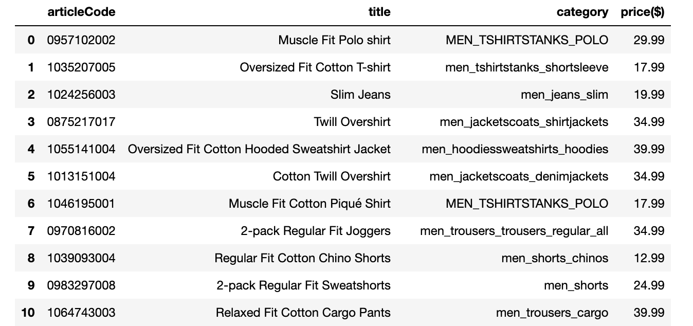

# H&M Personalized Fashion Transaction

## First part: Data Extracting

### First resources: Three csv files from Kaggle website 

The dataset is a about the purchase history of customers across time, along with supporting metadata.

Kaggle files:

-	articles.csv - detailed metadata for each article_id available for purchase
-	customers.csv - metadata for each customer_id in dataset
-	transactions_train.csv -  consisting of the purchases each customer for each date, as well as additional information. Duplicate rows correspond to multiple purchases of the same item. 

### second resources: Extracting data from H&M website by using a tricky api request

-	women_articles.csv - include price, title and product name of all women products

-   men_articles.csv - include price, title, product name of all men products

### cleaning and dataframe merging process

-	articles.csv - droping some unnecessary columns
-	customers.csv - imputing and droping null values
-	transactions_train.csv - converting a column as a datatime column
-   women_articles.csv - converting price column as integer
-   men_articles.csv - converting price column as integer 

## second part : Data Transformation

## Third part : Data Loading

