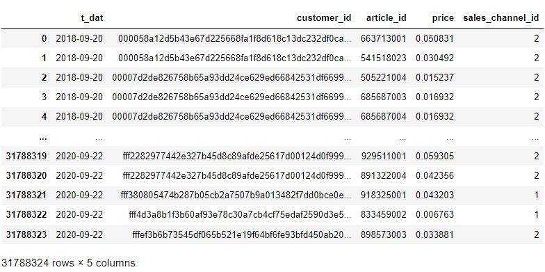
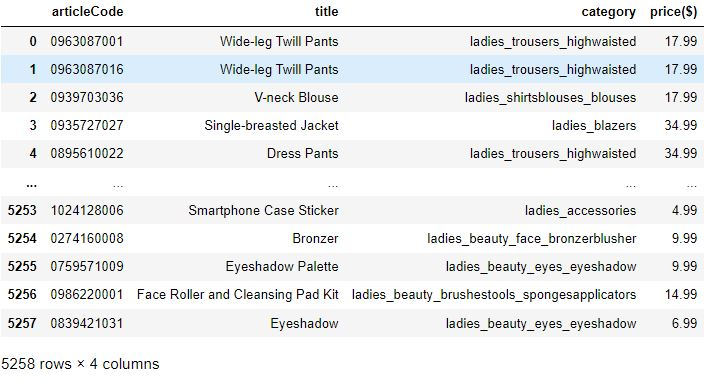
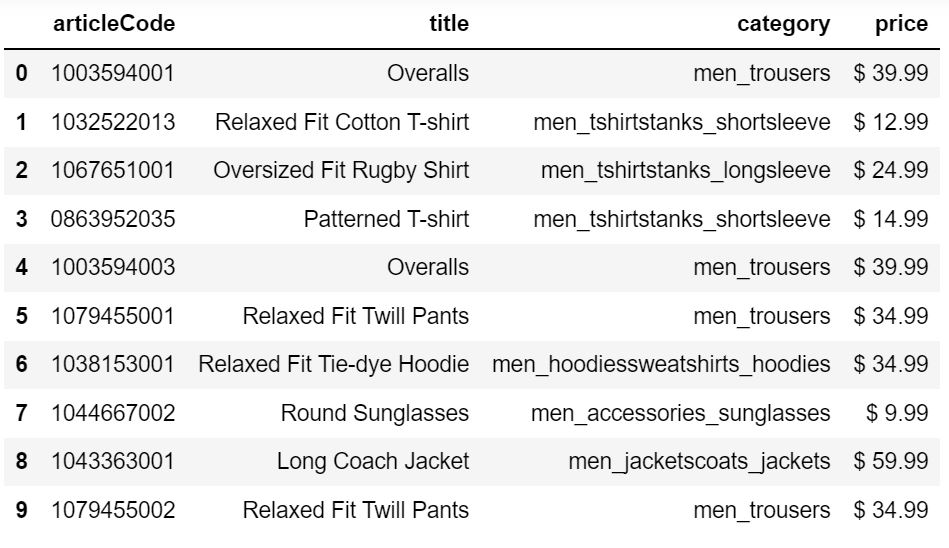
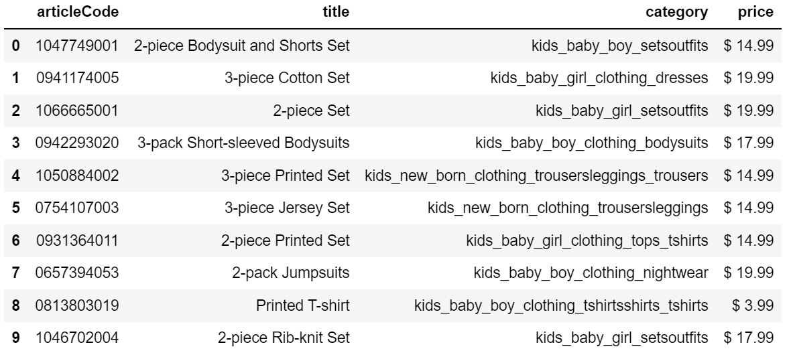
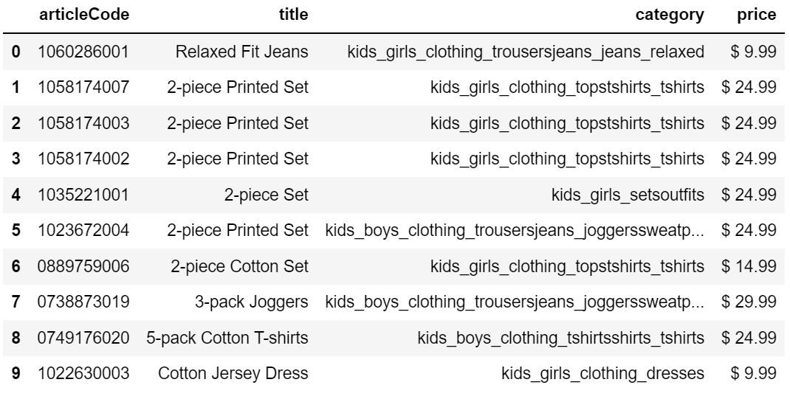
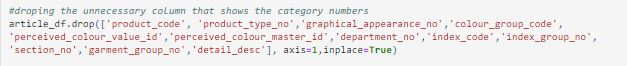
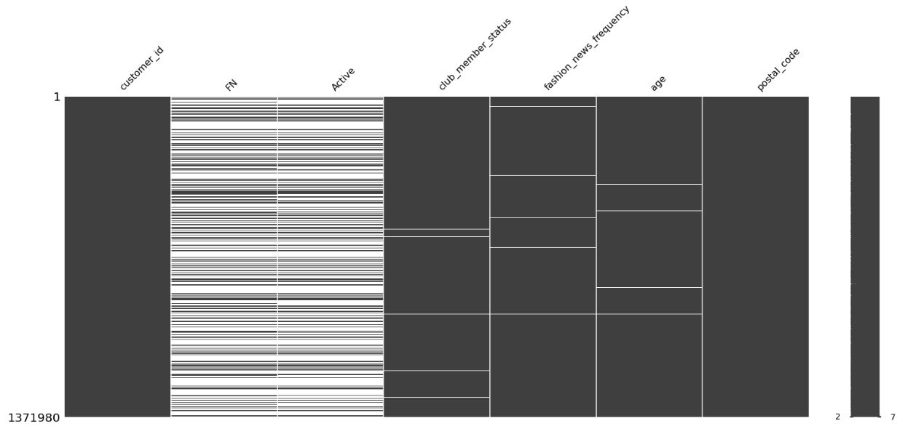

# H&M Personalized Fashion Transaction

## First part: Data Extracting

### First resources: Three csv files from Kaggle website 

The dataset is a about the purchase history of customers across time, along with supporting metadata.

Kaggle files:

-	articles.csv - detailed metadata for each article_id available for purchase
-	customers.csv - metadata for each customer_id in dataset
-	transactions_train.csv -  consisting of the purchases each customer for each date, as well as additional information. Duplicate rows correspond to multiple purchases of the same item. 

### Second resources: Extracting data from H&M website by using a tricky api request

-	women_articles.csv - include price, title and product name of all women products

-	men_articles.csv - include price, title, product name of all men products

-	baby_articles.csv - include price, title, product name of all baby products

-	kid_articles.csv - include price, title, product name of all kid products

## Second part : Data Transformation
For each of the different files, the following data transformations were performed:
-  **Deduplication**: Identifying and removing duplicate records
-  **Cleaning**: Removing duplicate values
-  **Format revision**: For example, in *transactions_train.csv*, we converted a column as a datatime column. Additionally, in *women_articles.csv*, *men_articles.csv*, *baby_articles.csv* and *kids_articles.csv* the price column was converted to an integer
-	**Key restructuring**: Establishing key relationships across tables. E.g. the tables relate with each other due to the 2 primary keys: customer_id and article_id.
-	**Filtering**: Selecting only certain rows and/or columns. 

-	**Data validation**: Simple or complex data validation – for example, if the first three columns in a row are empty then reject the row from processing
-	**Summarization**: Values are summarized to obtain total figures

Image of customers file before cleaning

## Third part : Data Loading

